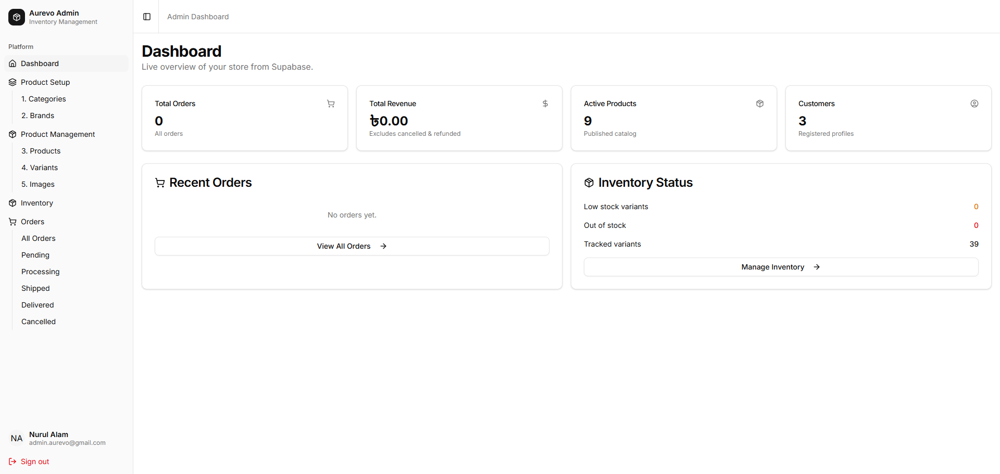
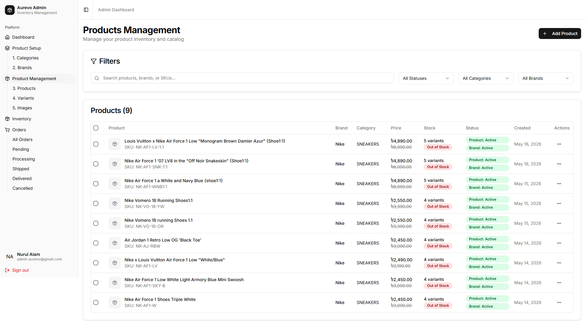
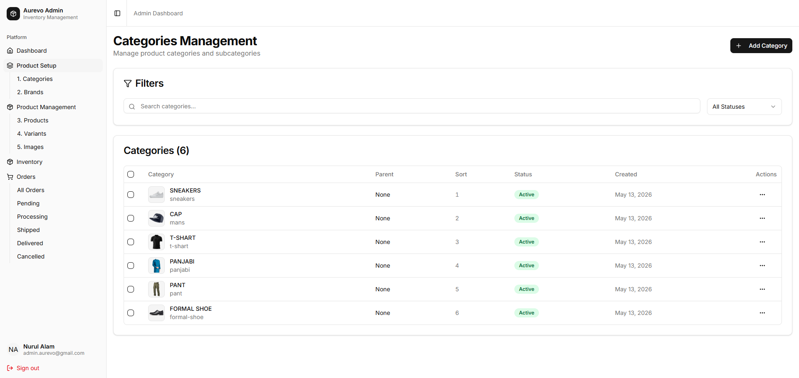

# Aurevo Fashion — Frontend E-commerce Store

Aurevo Fashion — Frontend E-commerce SPA. React 19 app built with Vite, TypeScript, TanStack Query, Tailwind CSS v4, Shadcn/ui, React Router v7. All data and auth go through **Aurevo.BE**; deployed on Vercel.


## Tech Stack

| Layer           | Library / Version                                   |
| --------------- | --------------------------------------------------- |
| Framework       | React 19.1.1                                        |
| Build           | Vite 7.1.7                                          |
| Language        | TypeScript 5.9.2                                    |
| Routing         | React Router 7.9.3                                  |
| Server state    | TanStack Query v5                                   |
| UI primitives   | Radix UI + Shadcn/ui                                |
| Styling         | Tailwind CSS v4                                     |
| i18n            | i18next + react-i18next (English + Bangla)          |
| Observability   | Sentry (`@sentry/react`) + top-level Error Boundary |
| Analytics       | Vercel Analytics / Speed Insights, Meta Pixel       |
| Icons           | Lucide React, Heroicons                             |
| Package manager | pnpm                                                |

> The Supabase JS SDK is **not** used in this app. Auth (including Google/Facebook OAuth) and all CRUD go through Aurevo.BE. An optional `VITE_SUPABASE_URL` is only for storage image-transform URLs.

---

## Screenshots

### Storefront


### Admin Dashboard



### Admin – Products Management



### Admin – Categories Management



---

## Features

### Storefront

- Product catalog with category, brand, gender, price filters + search
- Product detail with variant picker (size/color/SKU), stock availability
- Guest + authenticated shopping cart (slide-in cart side panel)
- Checkout with guest order support (no account required)
- Order confirmation page with itemised receipt and guest token access
- Saved addresses in the account dashboard; checkout can autofill from them
- Bangla + English UI (language switcher in the header; default English)
- Facebook Messenger floating chat + Meta Pixel events

### Account dashboard (`/dashboard`)

- Profile overview and edit
- Saved addresses (CRUD) with Bangladesh district / upazila helpers and location type (Home / Office / Pick Up)

### Admin Panel (`/admin`)

- Dashboard with order stats and revenue summary
- Products management — create/edit/delete, bulk status toggle, variant management, image uploads
- Variants — create single or bulk CSV upload, color picker, inventory sync
- Categories and Brands management with "Clear filters" controls
- Orders management — server-side pagination, search, status/payment/tracking/fulfillment updates
- Inventory levels — per-variant stock tracking, low-stock view, movement audit log, .xlsx export

### Authentication

- Email/password auth via Aurevo.BE (`POST /auth/login`, `POST /auth/register`)
- Google/Facebook OAuth is **backend-driven**:
  1. FE requests `GET /auth/oauth/url?provider=…` and redirects to the provider
  2. BE completes the OAuth callback
  3. FE lands on `/?oauth_code=…` and redeems `GET /auth/oauth/session?code=…`
  4. Tokens are stored in `localStorage` and the user is sent to the dashboard
- JWT in `localStorage` (`aurevo_access_token`), sent as Bearer token to Aurevo.BE
- Auto-refresh on 401 via `POST /auth/refresh`
- Logout calls `POST /auth/logout` then clears local tokens
- Guest cart auto-migrates to user account on sign-in (`POST /cart/migrate`)
- Guest order claim on login (matches by session ID, email, phone)

### Observability

- Top-level React Error Boundary with a recovery screen
- Optional Sentry error tracking + Session Replay when `VITE_SENTRY_DSN` is set

---

## Project Structure

```
src/
├── components/           # Shared UI components
│   ├── ui/               # Shadcn/ui primitives (button, card, dialog, …)
│   ├── cart-side-panel   # Slide-in cart drawer
│   ├── error-boundary    # Top-level error UI + Sentry report
│   ├── language-switcher # EN / বাং toggle
│   └── ...
├── constants/            # App paths, static config
├── contexts/             # React contexts (auth, guest cart)
├── hooks/                # Custom hooks (use-toast, use-cart, …)
├── i18n/                 # i18next setup + en/bn locale JSON
├── lib/
│   ├── api.ts            # Typed fetch wrapper (api.get / api.post / apiDownloadFile)
│   ├── currency.ts       # formatPrice (BDT)
│   ├── sentry.ts         # Optional Sentry init
│   └── meta-pixel.ts     # FB Pixel event helpers
├── pages/
│   ├── home-page.tsx
│   ├── products-page.tsx
│   ├── product-detail-page.tsx
│   ├── checkout-page.tsx
│   ├── order-confirmation-page.tsx
│   ├── dashboard-*.tsx   # Account dashboard (profile, addresses)
│   └── admin/            # All admin pages
├── routes/               # Route definitions (public / protected / guest / admin)
├── services/
│   ├── auth/             # Auth queries & mutations
│   ├── cart/             # Cart queries, mutations, totals helpers
│   ├── order/            # Order queries
│   ├── product/          # Product, variant, category, brand, image mutations
│   ├── inventory/        # Inventory levels, movements, low-stock, export
│   ├── user/             # Saved addresses
│   └── types.ts          # Shared TypeScript interfaces
└── test/                 # Vitest setup, MSW handlers, render helpers
```

---

## Local Development

### Prerequisites

- Node.js 20+, pnpm 9+
- Aurevo.BE running on `http://localhost:5000`

### Setup

```bash
cd Aurevo.UI
pnpm install
cp env.example .env.local
pnpm dev          # http://localhost:5173
pnpm build        # production build
pnpm typecheck    # tsc --noEmit
```

### Environment Variables (`.env.local`)

```env
# Backend REST API (required)
VITE_API_URL=http://localhost:5000/api

# Optional — Supabase project URL for storage image transforms only.
# The Supabase SDK is not used; all auth goes through Aurevo.BE.
# VITE_SUPABASE_URL=https://YOUR_PROJECT_REF.supabase.co
# VITE_USE_SUPABASE_IMAGE_TRANSFORM=true

# Facebook Messenger floating chat button
VITE_FACEBOOK_PAGE_ID=855862097613203

# Meta Pixel (ads & remarketing)
VITE_META_PIXEL_ID=1409609890385063

# Sentry (optional — no-op locally if unset)
# VITE_SENTRY_DSN=https://...@o....ingest.sentry.io/...
```

See [`env.example`](env.example) for the full template.

---

## Key Patterns

### API Layer (`src/lib/api.ts`)

All REST calls go through the typed `api` wrapper which:

- Reads `VITE_API_URL`
- Reads `aurevo_access_token` from localStorage and attaches `Authorization: Bearer <token>`
- Auto-refreshes on 401: calls `POST /auth/refresh` with `aurevo_refresh_token`, stores new tokens, retries once
- Attaches `X-Guest-Session: <id>` for guest cart/order calls
- Normalises camelCase BE responses to snake_case for legacy FE types where needed
- Returns typed JSON or throws on non-2xx

```ts
const data = await api.get<Product[]>("/products");
const order = await api.post<Order>("/orders", payload);
await apiDownloadFile("/inventory/export"); // triggers browser download
```

### TanStack Query Cache Keys

Query keys follow a consistent shape so invalidations are precise:

```ts
// Products
["admin", "products", filters][("admin", "images", productId)][
  // Inventory
  ("inventory-levels", filters)
][("low-stock-items", filters)][("inventory-movements", filters)][
  // Cart
  ("cart", userId, sessionId)
];
```

After any variant create/update/delete, all three inventory key groups are invalidated together via `invalidateInventoryQueries(queryClient)`.

### Cart — Two Stock Sources

- **`product_variants.stock / reserved_stock`** — what cart, availability checks, and checkout read
- **`inventory.quantity`** — what the Inventory admin page reads (kept in sync by BE on every adjustment)

These are different ledgers. `upsertInventory` syncs both atomically.

### Guest Cart Flow

1. `localStorage` stores `guest_session_id` (format: `guest_<ts>_<rand>`)
2. Sent as `X-Guest-Session` header on all cart requests
3. On login → `POST /cart/migrate` with `{ guestSessionId }` → BE merges guest rows into user cart
4. On success → `localStorage.removeItem("guest_session_id")` prevents re-migration

### i18n

- Locales: `src/i18n/locales/en.json`, `bn.json`
- Default language: English (`aurevo_language` in `localStorage` overrides)
- Switcher: header EN / বাং control (`src/components/language-switcher.tsx`)

### Order Confirmation Page

The page reads `?orderId=&orderNumber=&guestToken=` from the URL. The API returns camelCase item fields (`productName`, `variantName`, `unitPrice`, `totalPrice`); the component normalises both casings for backwards compat.

---

## Testing

~100 test files across components, hooks, services, and lib utilities.

| Tool                            | Role                                           |
| ------------------------------- | ---------------------------------------------- |
| Vitest 4                        | Test runner + coverage (v8)                    |
| Testing Library (React + Hooks) | Component / hook rendering                     |
| MSW v2                          | Network-layer API mocking (intercepts `fetch`) |
| jsdom                           | Browser environment simulation                 |

```bash
pnpm test             # single run (CI)
pnpm test:watch       # watch mode
pnpm coverage         # HTML coverage report
```

CI (`.github/workflows/ci.yml`) runs lint → typecheck → unit tests → build on PRs to `main`/`dev` and pushes to `main`. After merges to `main`, `merge-back.yml` fast-forwards `dev`.

See [memory-bank/TESTING.md](memory-bank/TESTING.md) for full details: test infrastructure, patterns, and what each layer covers.

---

## Available Scripts

```bash
pnpm dev              # dev server (port 5173)
pnpm build            # production build
pnpm typecheck        # TypeScript check (no emit)
pnpm lint             # ESLint
pnpm test             # unit tests (single run)
pnpm test:watch       # unit tests (watch)
pnpm coverage         # test coverage report
```

> DB scripts (`db:start`, `db:reset`, `db:migrate:*`, etc.) live in `Aurevo.BE` — run them from there.

---

## Related docs

| Doc                                                                      | Purpose                                |
| ------------------------------------------------------------------------ | -------------------------------------- |
| [memory-bank/TESTING.md](memory-bank/TESTING.md)                         | Vitest / MSW testing guide             |
| [memory-bank/RECENT_INTEGRATIONS.md](memory-bank/RECENT_INTEGRATIONS.md) | Summary of recent feature integrations |
| [memory-bank/RECENT_FIXES.md](memory-bank/RECENT_FIXES.md)               | Bugfix / change log                    |
| [env.example](env.example)                                               | Environment variable template          |

---

## Browser Support

Chrome 90+, Firefox 88+, Safari 14+, Edge 90+, modern mobile browsers.
